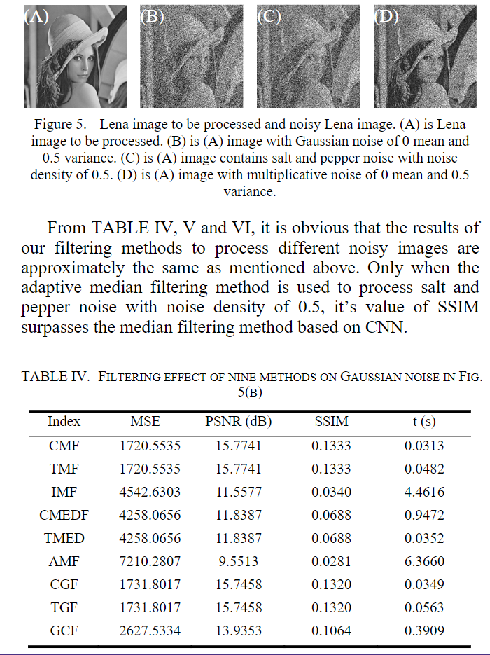

## 文献题目：Research on image filter template based on cellular neural network

**DOI(url): https://ieeexplore.ieee.org/document/9588127**

**发表日期: 2021-09-23**

### **关键点**
本文将图像滤波结合CNN，设计了三种滤波器：mean filter, median filter, Gaussian filter.  
与传统的六种图像滤波器（mean filter, median filter, Gaussian filter, iterative mean filter(IMF), adaptive median filter(AMF), Gaussian curvature filter(GCF)）进行了比较。  
实验结果表明，基于CNN的滤波器能实现与传统的相同的甚至更好的效果，但运行时间(mean filter and Gaussian filter)要更短。 

CMF: mean filter based on CNN  
TMF: traditional mean filter  
IMF: iterative mean filter  
CMEDF: median filter based on CNN  
TMEDF: traditional median filter  
AMF: adaptive median filter  
CGF: Gaussian filter based on CNN  
TGF:  traditional Gaussian filter  
GCF: Gaussian curvature filter  

### **参考意义**
给出了超强噪声下的算法运行时间。  
相对来说，CMF运行时间较短，但仍有二三十毫秒。  

### **与我相关**

### **相关文献**
[[1] Different Adaptive Modified Riesz Mean Filter For High-Density Salt-and-Pepper Noise Removal in Grayscale Images](Samet2021-Different%20Adaptive%20Modified%20Riesz%20Mean%20Filter%20For%20High-Density%20Salt-and-Pepper%20Noise%20Removal%20in%20Grayscale%20Images.md)