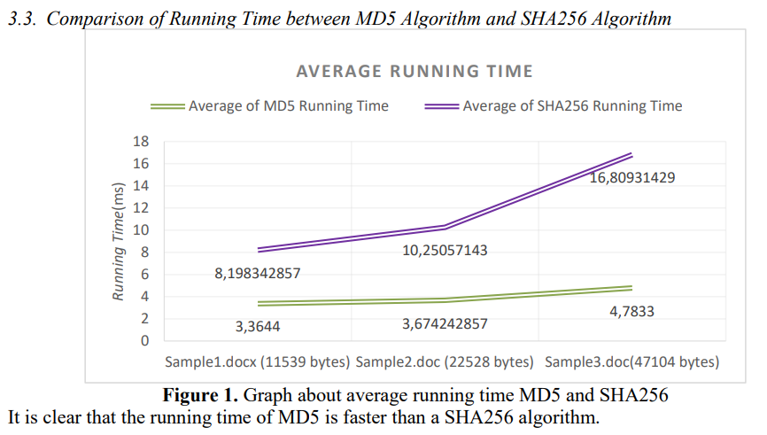

## 文献题目：A comparative study of Message Digest 5(MD5) and SHA256 algorithm

**DOI(url): https://iopscience.iop.org/article/10.1088/1742-6596/978/1/012116**

**发表日期: 2018-03**

### **关键点**
本文着重于MD5和SHA256，分析了各自的优缺点，讨论了二者的运行时间和复杂度，基于此标准得出结论：二者复杂度一致，但MD5的运行时间要远快于SHA256。

### **参考意义**
在屏幕内容分析方面，对每一帧进行分块后，通过散列算法进行运算，与参考帧的对应块做比较（AV1的自适应分块是否会对比较过程有影响？），将哈希值不一致的作为变动块，根据变动块比例判断当前帧为动态帧还是静态帧（需要设立阈值），为了适应实时性，就需要在运行时间和准确率之间做权衡，MD5的运行时间要远快于SHA256。  

上图的逗号是小数点。  

一张128x128，8bits色深的图像，大小约16384字节，对应的MD5运算时间不超过4ms。

### **与我相关**
还可以比较CRC32和MD5的运行时间。  
CRC32更强调速度，不注重安全性。  
MD5是one-way-hash。  

### **相关文献**
[[1] Samanta2021-Analysis of Perceptual Hashing Algorithms in Image Manipulation Detection](./Samanta2021-Analysis%20of%20Perceptual%20Hashing%20Algorithms%20in%20Image%20Manipulation%20Detection.md)