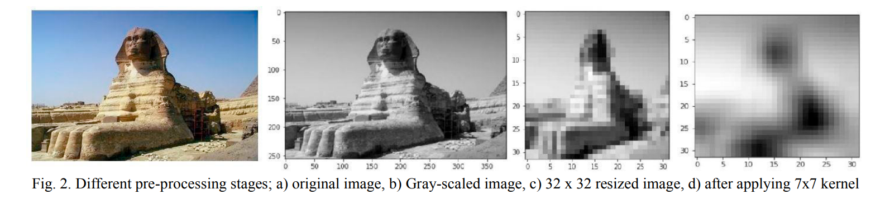
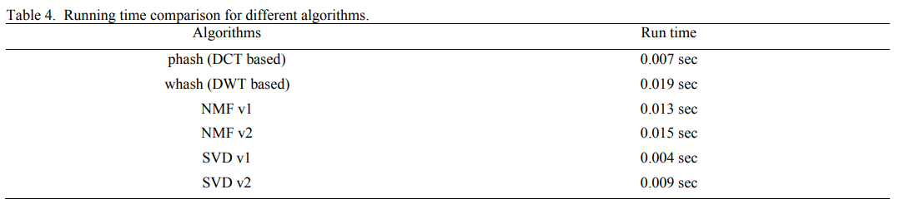

# 文献精读2022-04-07

## 文献信息

**标题: Analysis of Perceptual Hashing Algorithms in Image Manipulation Detection**

**DOI(url): https://doi.org/10.1016/j.procs.2021.05.021**

**发表日期: 2021-06-10**

**发表杂志: Procedia Computer Science**

**关键词: Perceptual hashing, Image manipulation detection**

---
## 文献概述
感知图像哈希是基于图像内容的散列算法，不同于加密哈希，感知哈希算法是为了当图像发生细微变化的时候，例如压缩、色彩校正、亮度变换，所生成的哈希值不会有太大的改变（**不是一点都不变化**）。  

本文利用两个公开的数据集(CASIA2.0 和 Photoshop Battle)对多种感知哈希算法进行了综述和性能分析，结果表明感知哈希算法在区分非法与合法修改的图像方面表现不佳，基于此，论证了感知哈希算法的局限性以及未来的改进方向。  

本文旨在解决如下问题：给定一个输入图像、限定长度的字符串（哈希值）、包含原始图像的或其哈希值的数据库，利用算法如何准确判断输入图像的内容是否发生了改变。  

感知哈希算法目前已用于筛选已知的被禁的、重复的以及相似的图像。  

本文评估了基于pHash算法的几种特征提取技术。  

---
## 文献笔记
**CC: content changing**，主要操作包括1. 换脸； 2. 裁剪； 3. 添加logo或文字； 4. 添加物体； 5. 拷贝/移动； 6. 更换背景。  

**CP: content preserving **，保留图像内容的操作包括JPEG压缩、滤镜（更换颜色）、模糊、Gamma矫正（调整亮度）。   

### **感知哈希算法步骤：**
1. 获得两张图像的哈希值$h_I=H(I), h_{I'}=H(I')$  
2. 获得相似矩阵$D(h_I, h_{I'})$，相似阈值$\tau$
3. 若$D<\tau$，则认为I'是对图像I做微小调整生成的图像  

感知哈希算法主要有三个步骤：图像预处理、感知特征提取、通过量化或压缩生成最终的哈希值。 

不同的哈希算法区别主要在于对感知特征提取的方式不同。  

- **图像预处理**：减小数据大小以缩减后续处理时间，包含以下处理：调整尺寸、色彩变幻、归一化、直方图均衡化(histogram equalization)，还需要通过高斯噪声滤波移除噪声，但对于屏幕内容可略去，直方图均衡化用于提高对比度。  
- **特征提取**：主要有两类技术，i)频域变换，如Discrete Fourier Transform (DFT), Discrete Cosine Transform (DCT), Discrete Wavelet Transform (DWT), Fourier-Mellin transform；ii)降维，如Principal Component Analysis (PCA), Non-Negative Matrix Factorization (NMF) and Singular Value Decomposition (SVD)  
- **量化并生成哈希值**：常用统计属性来量化特征值，如中值、平均值  
- **相似矩阵**：相似矩阵中常用的有汉明距离、归一化的汉明距离、欧氏距离、误比特率bit error rate、互相关峰值peak cross-correlation。  

### **实验结果**
先将图像调整为灰度图像，利用区域插值调整为32x32，然后应用7x7 average filter kernel，再应用感知哈希算法。  

因为目标检测和基于形状上下文的哈希是非常不同的方法，并且很可能需要耗费大量计算资源，所以本文没有加以评估。  

**本文评估了四种特征提取方法：DCT、DWT、NMF、SVD。**  
pHash: DCT，预处理后，计算32x32图像的DCT值，为一个32x32的系数矩阵，左上的8x8系数用于计算最终的64位哈希值，每一个系数与8x8=64个系数的中值进行比较，小于等于则量化为0，大于则为1。  
wHash: DWT，最终也是量化为0或1，生成256位的哈希值。  
NMF: 本文研究了两版NMF算法，NMF-1生成160位哈希值，NMF-2生成320位哈希值。  
SVD: 本文研究了两版SVD算法，SVD-1生成160位哈希值，SVD-2生成320位哈希值。  

Fig. 3 归一化汉明距离for内容改变操作  
Fig. 4 归一化汉明距离for内容保留操作  

Fig. 3 SVD有更高的均值和中值，意味着在内容变更检测方面，SVD性能更好；  
Fig. 4 pHash和wHash在内容保留方面性能更好，且pHash的准确率比wHash的高。  

**$\tau$的选取**：对content changing和content preserving画归一化汉明距离的概率密度函数分布图，找出二者的交点，对应的归一化汉明距离作为$\tau$，该值对于不同的算法、不同的数据集取值不同。  

**NMF能够检测到低对比度的改变，这是基于DCT的pHash所检测不到的。**

---
### **文章亮点**
本文比较了不同算法的running time，根据对运行时间和准确率的权衡，最终选择pHash。  
下图是对100张图运行算法后取平均值，即**单张图像的运行时间**。    

---
### **可改进**
需要理解如何量化，对于哈希结果的紧密表示很重要，会影响降维技术的性能。  
鉴于DCT在检测CC和CP的优势，在降维后计算DCT也许可以获得更好的量化。  
如果结合两种特征提取过程，可能利于对DCT结果系数计算哈希值。  

---
### **和我相关**
pHash对整幅图像的微小修改不敏感，比如在原图像上添加与背景相似对比度的物体object，pHash的值并不会有多少改变，于是做相似度量的时候可能小于阈值，无法被检测。  

---
### **我的疑问**

---
## 相关文献
[[1] A comparative study of Message Digest 5(MD5) and SHA256 algorithm](./Rachmawati2018-A%20comparative%20study%20of%20Message%20Digest%205(MD5)%20and%20SHA256%20algorithm.md)
