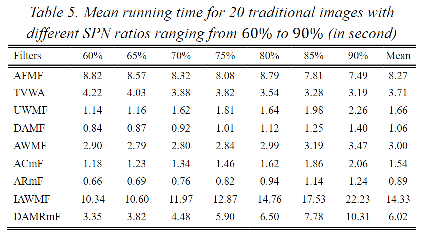

## 文献题目：Different Adaptive Modified Riesz Mean Filter For High-Density Salt-and-Pepper Noise Removal in Grayscale Images

**DOI(url): https://dergipark.org.tr/en/doi/10.31590/ejosat.873312**

**发表日期: 2021-04-30**

### **关键点**

### **参考意义**
运行时间耗时长  

  
### **与我相关**

### **相关文献**
[[1] Research on image filter template based on cellular neural network](../202204/Li2021-Research_on_image_filter_template_based_on_cellular_neural_network.md)