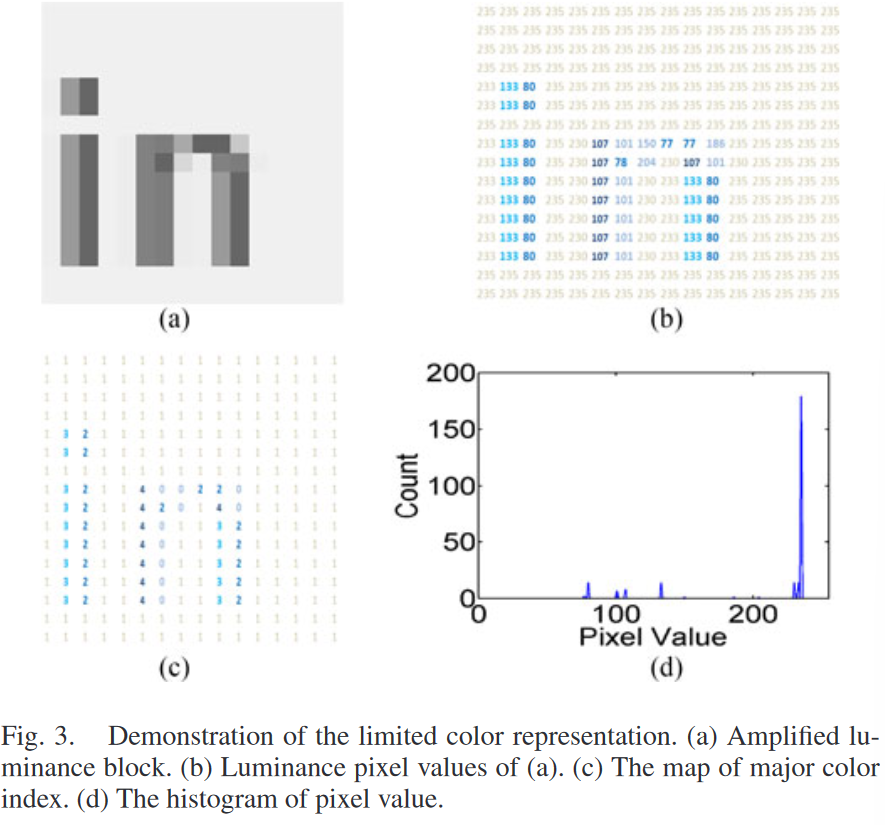
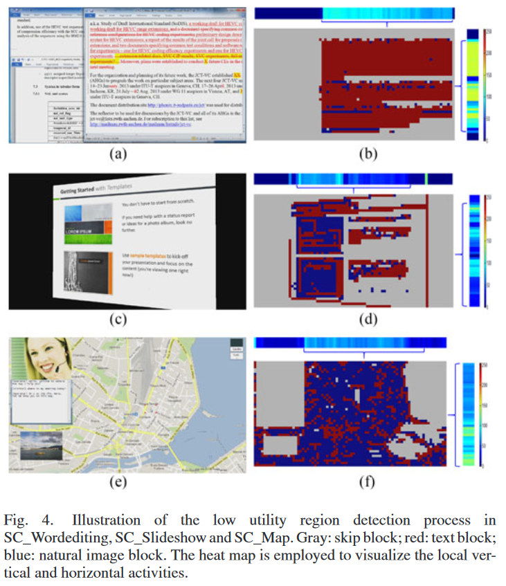

# 文献精读2022-04-17

## 文献信息

**标题: Utility-driven adaptive preprocessing for screen content video compression**

**DOI(url): 10.1109/TMM.2016.2625276**

**发表日期: 2017-03**

**发表杂志: IEEE Transactions on Multimedia**

**关键词: Block type identification, screen content video(SCV), temporal masking, utility information**

---

## 文献概述
提出了一种基于掩蔽效应的实用性驱动utility-driven的屏幕内容预处理技术，基于感知效用可以在保持高实用性内容质量的同时，将低实用性区域用对应的平滑版本进行替换。 

为了区分区域的实用性，专门为屏幕内容设计了块类型识别算法，然后对检测到的低实用性区域用高斯滤波对其中的高频成分做平滑处理，以降低比特率。 

当查看一张图片的时候，人类视觉系统的主要任务就是实现最优信息提取。这驱动了本文从感知实效方面研究屏幕内容视频的temporal masking properities，<b>因为高实用对应于需要被interactive screen-remoting mechanism提取的高信息量的内容（high information content）</b>。 

基于image utility assessment，只要能完成底层任务（基础任务，underlying task），恰当地在低实用区域注入distortion是可以被容忍的，as the HVS will regard the usefulness of the image as a surrogate for a reference. 

面向屏幕内容视频，实用性的特点就是屏幕内容刷新时的时间稳定性（the utility can be characterized by the temporal stability in screen content refreshing），例如渐入渐出、缩放等操作都可能产生低实用区域，因为这些帧的主要任务就是承当内容刷新期间的平滑过渡，所以，这些内容的平滑版本能提供与SCV等价的utility。 

In this paper, we propose an utility-driven adaptive preprocessing approach for SCV compression. 
<b>这个方法将使用高斯低通滤波对低实用内容进行识别和处理</b>，通过有效降低低实用区域的比特率来实现更高的编码效率。 

先计算<b>两相邻帧的均方差(MSE)</b>来比较内容变动程度。（如果是静态帧，MSE会为0，计算MSE和分块应用散列的速度比较？） 

放缩、渐入渐出、窗口移动、页面滑动等操作会导致大量内容变动，而这些变动没有很好的参考预测，但是，对这些操作的编码任务主要是保证平滑过渡，而不在乎其中的信息量，因为高实用内容通常在连续帧中能够保持稳定，达成信息提取，所以对低实用内容进行模糊压缩可以节约比特率，为未来帧保留更多带宽和缓冲区以保证SCV质量。 

低实用区可以是整帧，也可以是SCV中的部分区域，为了识别出这些内容，需要先获取每帧的时空特性以识别块类型。本文应用对象级的区域检测来定位低实用内容，然后对检测到的低实用性区域用高斯滤波做平滑处理，生成等价实用性的SCV。 

---

## 文献笔记

---

### **识别块类型**
先将每帧分成不重叠的块，然后对每块进一步划分为skip、text、natural image三种类型块。 

---

#### **1. Skip Block**
有两种情况：没有内容变更的固定块；滚动、窗口移动等全局运动块。 

- fixed block：通过将当前块和相邻帧的同位块进行比较可以很容易判断内容是否有变动。
- global motion block：利用基于特点比较的全局运动检测技术定位全局运动区域[34]。

#### **2. Text Block**
基于文本块通常具有尖锐边缘，我们利用从MxN块的高梯度像素数目中导出的二值特征，进行高梯度块类型分类。 

$$\zeta = u(\sum_{k=1}^{M-1}\sum_{l=1}^{N-1} \gamma_{k,l}-T_{HF})$$

$T_{HF}$ 是高梯度像素的阈值（梯度值） 

函数$u$是阶跃函数，如下： 
$$u(x)=\left\{
    \begin{array}{rl}
    1,  &x>0\\
    0,  &otherwise.\\
    \end{array}
\right. $$

参数$\gamma_{k,l}$是一个二元值，表示第$(i,j)$个像素是否是高梯度像素。 
$$\gamma_{k,l}=u(|I_{k,l}-I_{k-1,l}| > I_{th} \vee |I_{k,l}-I_{k,l-1}|>I_{th})$$
$I_{th}$是预定义的阈值，$I_{k,l}$代表$(k,l)$位置的luma样本。 

<b>在典型SCV帧中，高梯度块可能是文本块，也可能是自然图像区的边缘块。为进一步区分图像和文本区域，再应用base color-index map进行处理，限制base color数为4（相对于16x16的块大小），不能被base color表示的定义为escape color，如果escape color的数目小于一个确定的阈值，那么就认为当前块为文本块，否则是natural image block。</b> 

---

#### **3. Low Utility Region Detection**
给定块类型，对每帧进行低实用区域的自适应检测。 

<b>skip block不需要进行低实用区域检测</b>，因为这些块很可能被后续帧作为参考帧或是继承于上一帧，所以如果将skip block纳入低实用区，可能会破坏时间一致性，降低编码效率。 

对于text block和natural image block，采用概率策略（probabilistic strategy）定位低实用区域。 

使用二值$m(m \in \{1,0\})$表示当前块是否被包含于低实用区域，<b>1表示被包含</b>。 

给定第$t$帧的第$(i,j)$块，$m_{i,j,t}$的后验概率可以用贝叶斯定理进行预测。 

$$p(m_{i,j,t}|f_{i,j,t})=\frac{p(f_{i,j,t}|m_{i,j,t})p(m_{i,j,t})}{p(f_{i,j,t})} \tag{4}$$

<b>$f_{i,j,t} \in \{1,0\}$表示块类型，1表示文本块，0表示自然图像块。</b>由此$m_{i,j,t}$的最大后验（maximum a posteriori，MAP）估计定义为： 

$$\left. 
    \begin{array}{rl}
    \hat{m}_{i,j,t} & = \argmax\ p(m_{i,j,t}|f_{i,j,t})\\
    &= \argmax\ p(f_{i,j,t}|m_{i,j,t})p(m_{i,j,t})\\
    \end{array}
    \right. \tag{5}
$$

<mark><b>后面的公式不看也可以。</b></mark> 

似然函数： 
$$p(f_{i,j,t}|m_{i,j,t})=p(f_{i,j,t}|1)^{m_{i,j,t})} p(f_{i,j,t}|0)^{1-m_{i,j,t}}) \tag{6}$$

Inspired by the pairwise interaction markov random field，we model the prior distribution $p(m_{i,j,t})$ based on the previous $t_0$ frames in the following form:  
$$
p(m_{i,j,t}) \propto exp \left( \sum_{s=0}^{t_0} \beta_{t,t-s} \epsilon_{m_{i,j,t}= m_{i,j,t-s}} \right) \tag{7}
$$

$\beta_{t,t-s}$遵循一维高斯分布，标准差$\sigma=1.5$  

$$\beta_{t,t-s} = \frac{\alpha}{\sigma \cdot { \sqrt{2\pi} } } exp \left( -\frac{s^2}{2\sigma^2} \right) \tag{8}$$ 

参数$\alpha$用于平衡prior和likelihood。 

$$
\epsilon_{m_{i,j,t}= m_{i,j,t-s}}= \left\{
\begin{array}{rl}

1, &m_{i,j,t}=m_{i,j,t-s}\\
0, &otherwise.\\

\end{array}\right. 
$$

结合公式(6)(7)，对后验分布取对数 
$$
\begin{array}{rl}

\ln{p(m_{i,j,t} | f_{i,j,t})} =& \ln{p(f_{i,j,t}|0)} + \phi_{i,j,t} \cdot m_{i,j,t} \\
& + \sum_{s=0}^{t_0} \beta_{t,t-s} \epsilon_{m_{i,j,t}= m_{i,j,t-s}}\\

\end{array} \tag{9} 
$$

$\phi_{i,j,t}$代表log-likelihood的比率： 

$$
\phi_{i,j,t} = \ln{[p(f_{i,j,t}|1)/p(f_{i,j,t}|0)]} \tag{10}
$$

<mark><b>前面的公式不看也可以。</b></mark> 

事实上，可以只考虑$m_{i,j,t}=1$的情况，根据经验，likelihood可以定义为： 
$$
p(1|1) = \frac{e}{1+e}\ and \ p(0|1)=\frac{1}{1+e} \tag{11}
$$
<small>$e$是自然对数。</small> 

这表明，文本块最有可能位于低实用区域，与所提出的设计理念一致。 

平滑过渡时的低实用区域主要由不稳定的文本块和统一的平坦区域（flat areas）组成，很难从这些区域中提取有用的信息。 

因为不需要对平坦区域做处理，此处只考虑富文本区域（abundant text blocks）。此外，对于自然图像块分配较低的概率也是合理的，有助于提升播放视频时的算法鲁棒性。 

<small>概率越高越有可能位于低实用区域。</small> 

将概率作为权重因子分配给每个块类型： 

$$
\rho_{i,j} = \left\{
    \begin{array}{cl}
    0 & ,\text{skip block}\\
    p(1|f_{i,j,t}) & ,otherwise. 
    \end{array}
    \right. \tag{12}
$$

为了最终定位低实用区域，需要考虑两个特征，代表水平和垂直方向上的图像块活动（activity，看Fig.4），通过沿着水平和垂直方向的累积$\rho_{i,j}$获得。 

$$
A_{Hor}(i) = \sum_{j=1}^{H} \rho_{i,j} \ and \ A_{Ver}{j} = \sum_{i=1}^{W} \rho_{i,j} \tag{13}
$$

$H$和$W$表示帧的高和宽，以16x16的块为单位进行测量。 

在每一个方向上，块集中于高值范围意味着是富文本块，对应于有较高概率位于低实用区域。因此，可以用沿每个方向的独立于平均activity value的阈值来对低实用区域做滤波处理。 

经上述处理，可以自动检测自然视频区域的边界。 

---

#### **4. Low Utility Region Processing**
本文应用circular-symmetric Gaussian filter处理识别到的低实用区域，并对其中的高频信息做平滑处理。

---

### **实验结果**

---

### **文章亮点**

---

### **和我相关**

---

### **我的疑问**

---

## 相关文献
[34] Christiansen B O, Schauser K E. Fast motion detection for thin client compression[C]//Proceedings DCC 2002. Data Compression Conference. IEEE, 2002: 332-341.  

