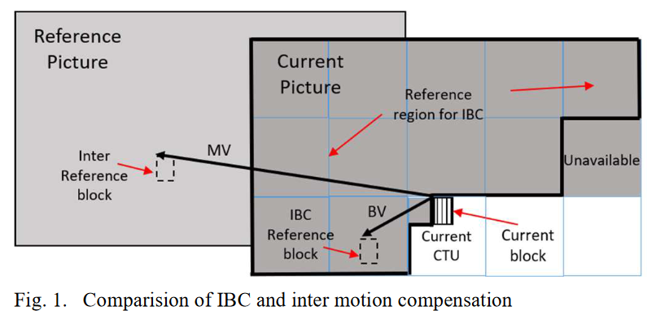
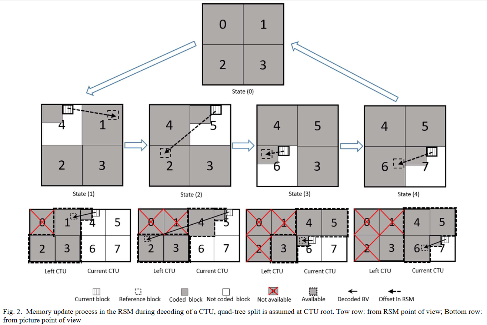
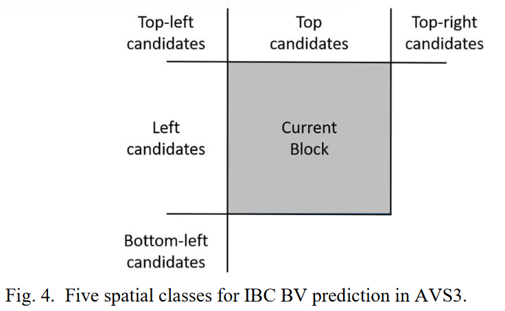
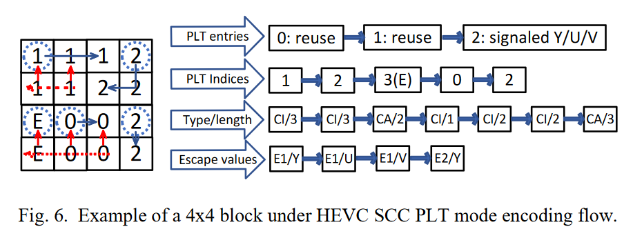
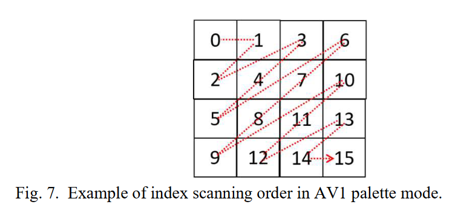
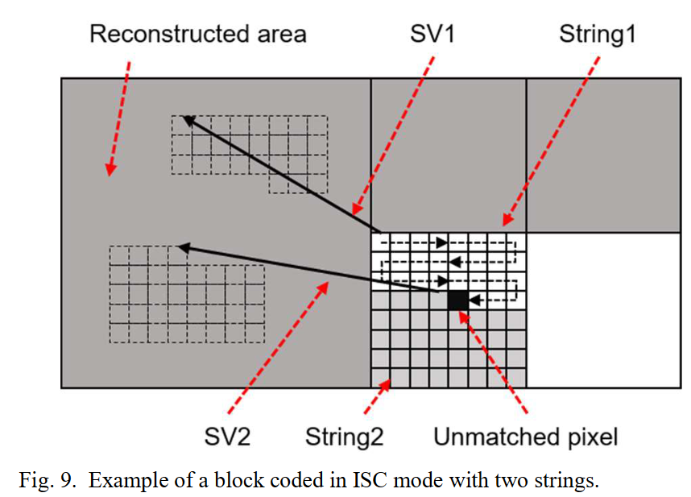
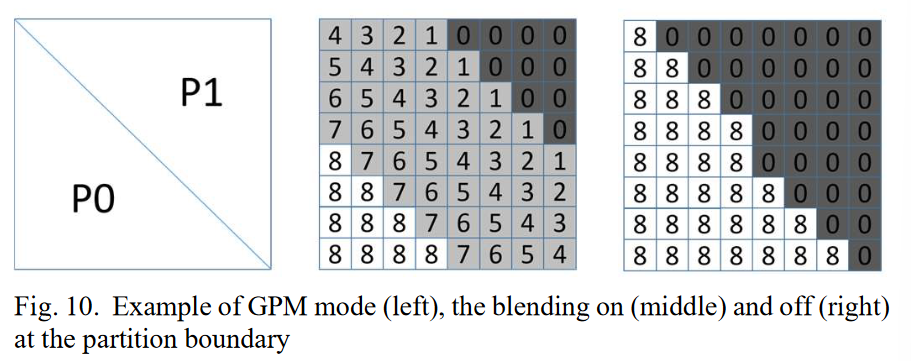

# 文献精读2022-04-08

## 文献信息

**标题: Xu2021-Overview of Screen Content Coding in Recently Developed Video Coding Standards**

**DOI(url): https://ieeexplore.ieee.org/document/9371731/**

**发表日期: 2022-02**

**发表杂志: IEEE Transactions on Circuits and Systems for Video Technology**

**关键词: Screen content coding, intra block copy, transform skip residue coding, BDPCM, palette mode, intra string copy, deblocking**

---

## 文献概述
屏幕内容screen content有别于传统的相机采集的视频camera-captured, natural video，信号特征和人眼视觉对扭曲distortion的敏感度都有着明显区别，需要专门对编码工具进行改进以适应屏幕内容。 
然而，不同编码标准所包含的SCC工具有着很大区别，每种标准可能只包含了一部分已知工具，而且，对于特定的编码工具，当其应用于不同的编码标准时，其技术特征也会有区别。  
本文对近期的编码标准(HEVC SCC, VVC, AVS3, AV1, EVC)中包含的屏幕内容编码工具进行了比较和综述，讨论了相关工具的性能和复杂度。 

### SCC Tools: 
1. Screent content coding specific technologies  
   - Intra block copy(IBC) 帧内块拷贝
   - Palette mode coding(PLT) 调色板  
   - Transform Skip Residue Coding(TSRC) 跳过变换残差编码
   - Block based differential pulse code modulation(BDPCM) 基于块的差分脉冲编码调制
   - Intra string copy(ISC) 帧内字符串拷贝
   - Deblocking filter(DBK) 去块滤波器
2. Screen content coding related technologies
   - Integer motion vector difference(IMVD) 
   - Intra subblock partitioning(ISP) 帧内子划分
   - Geometrical partition blending off(GPBO) 
   - Adaptive Color Transform(ACT) 自适应颜色变换
   - Hash based motion estimation(HashME) 基于散列的运动估计

---

## 文献笔记
### **Intra Block Copy(IBC)**
IBC是基于块的预测技术，其原理类似于帧间运动补偿(MC, motion compensation)，区别在于IBC的参考样本来自当前帧（已重建部分）内部（用current picture referencing来反映IBC和帧间运动补偿的相似性）。 

 
HEVC SCC中的IBC就像上图所示，白色区域是当前被解码帧的尚未编码区，灰色区域中的样本sample是已重建部分，封闭实线区域建立了可用的参考区域，为当前CTU留下已重建部分的右上区域用于并行运算。 

---

#### **1. IBC in HEVC SCC**
实现方式几乎和HEVC的帧间运动补偿一样，使用相同的语法结构和相近的解码过程。为了实现这一点，当启用IBC时，在进入环内滤波（包括deblocking和SAO, sample adaptive offset）之前的当前（部分）被解码的帧也被视为参考帧。在这种方式下，还定义了基于块的运动补偿和基于块的帧内sample拷贝。对于帧间模式下的编码块，如果参考索引指向当前被解码的帧，那么就启用IBC，否则使用传统的帧间模式。 

更多HEVC SCC关于IBC的细节可参考[7]。 

关于IBC的实现，其对现有的软件设计没有影响，因为内存分配在存储当前解码帧和存储其他参考帧的时候没有区别，除此之外，IBC模式的解码操作与现有的帧间模式十分相似，然而，关于硬件设计，以上提到的基于全帧的IBC模式不仅仅需要添加另一个参考帧。 

在运动补偿的典型硬件设计中，当前解码帧将会在完成所有环内滤波操作后被分配到芯片外的内存中off-chip，这一操作通常是逐片完成(done piece by piece)，比如CTU单元。当执行运动补偿时，当前编码块需要参考帧中的off-chip块，将会在芯片上（on-chip）获取与参考块相关的数据（如果还有插值操作，则还包含周围的样本）。整个读写过程涉及内存带宽开销，而内存带宽在硬件系统中需要慎重考虑。 

"我们期望HEVC SCC中的IBC模式表现与帧间模式能一致，从而复用现有的帧间运动补偿模块，希望能在main文件中将其扩展。然而，IBC模式与帧间运动补偿有两点区别： 
- IBC模式的当前参考帧(current reference picture)是当前解码帧的未过滤版本，与用于显示或作为未来参考帧的滤波后的帧有区别，如果将现有的MC模块用于实现IBC模式，除了滤波后的帧，还需要将未滤波的帧放到芯片外(be put off-chip)，额外帧写入到芯片外会导致内存带宽的增加。 
- **在IBC模式中一个刚重建的邻居块可能成为下一个编码块的参考块**，在整个“解码块-将重建块写到芯片外-将其作为参考块重新读回到芯片中”过程，对于时间的把控十分重要，而**这一点在典型硬件设计中被认为是不可实现的**。 

因为实现的困难，限制了HEVC SCC标准在硬件上的部署。为了便于IBC模式的硬件实现，在后续的标准中对IBC的当前帧可参考区域做了调整。 

---

#### **2. IBC in VVC**
- 参考帧范围设计 
基于[上述考虑](#reference-range)，如果允许在全帧范围内选择参考帧，将给周期预算带来困难，并增加内存带宽。 
VVC中的IBC模式设计最引人注意的区别就是要限制本地可被允许的参考范围。在这种方式下，需要用到的参考样本会存储在芯片内存上，这样可以解决内存带宽和实现时间的问题。 
在[9][10]中提出了允许当前CTU纳入搜索范围，认为芯片上的内存只会分配一个CTU大小的空间(referred as reference sample memory, or RSM)给IBC预测。这一限制是IBC模式首次采用的版本，认为是在编码效率和实现开销之间做了较好的权衡。后来，[11]对这一RSM复用机制作了介绍，允许从左侧已编码的CTU中选择一些样本用于IBC。 
这一[复用方法](#RSM-reuse)让所需的RSM大小不变，同时能有效提升IBC的性能。 
下图展示了这种内存复用机制的样例。 

在每一个CTU的起始，RSM会存储之前已编码的CTU的样本(state(0))，当当前块位于当前CTU的其中一个64x64区域内，RSM中的对应区域将被清空，用于存储当前64x64编码区域的样本。利用这种方式，RSM中的样本将逐步更新为当前CTU的样本，一旦当前CTU完成编码，整个RSM都被当前CTU的样本填满(state(4))。 
在这一样例中，当前CTU第一次用四叉树(quad-tree split)进行划分，四个64x64区域的编码顺序是左上、右上、左下、右下。在其他的划分块中，RSM 更新过程是类似的：用当前CTU中已重建的样本替换RSM中的各个区域。RSM复用设计的更多细节可参考[12] 
**需要注意的是，实现上述内存复用机制，IBC模式中最大块被限制为64x64。** 

- Dual-tree structure handling
在VVC中，亮度和色度组件可以使用不同的块划分结构单独进行编码。具体来说，一个被两个色度组件共享的块划分结构独立于CTU中用于亮度组件的块，这种编码结构被视为双树结构(dual-tree structure)：这种划分要么从CTU根部开始(全局双树global dual tree)，只能被用于帧内编码片，要么是局部小块(局部双树local dual tree)，当全局双树不可用时启用。 
传统的编码结构包含亮度块和两个相应的色度块，被称为joint-tree结构。 
在双树结构下，与亮度样本区域对应的色度块也许会覆盖多个亮度块，因此不能从已分配的亮度块中获取它的块矢量。**为了简化，只有亮度luma组件能够采用IBC模式，而色度chroma组件可以选择一个可用的帧内编码模式进行编码。** 

- Block vector coding 块矢量编码
VVC不再将IBC作为其帧内模式的部分，而将其作为独立的一种编码模式，与VVC帧间模式中的运动矢量编码相比，IBC拥有独立的矢量编码引擎。
    - 简化的合并候选列表设计：包括2个空间相邻块的块矢量和5个基于历史的块矢量预测器，列表中至多有6个候选者，同一个预测器列表的前两个条目还会被用于非合并块矢量预测模式。
    - 块矢量差分编码(BV difference coding)共享运动矢量差分编码(MV difference coding)模块。
    - 在该模块操作被用于块矢量解码后，参考块将始终位于当前CTU或左侧CTU(s)，这样，若满足给定的RSM复用条件，任意的解码块矢量值都是有效的。

 

---

#### **3. Design of IBC Mode in EVC and AVS3**
不同于VVC中的BV编码，EVC和AVS3采用了更简化的BV编码机制。 
在EVC中，BV编码复用MVD（motion vector difference）编码模式，但取消了BV预测机制。 
在AVS3中，取消了IBC的合并模式概念，BV预测来自基于类的概念，其中基于历史的BV列表首次被创建，并且每当进行块矢量或字符串矢量编码的时候就会对其更新。历史表中会记录矢量值、编码块位置、块大小、发生频率。对于每一个IBC编码块，CBVP表（<mark>class-based BV prediction</mark>）通过将每一个基于历史的列表中的条目分成7类，每一类都包括块大小（比32个样本的大）、频率（过去发生过不止一次）以及五个位置（如图Fig.4）。每个索引是独立的，用于表示选择7类中的哪一类。**在解码器一侧，所选择的类的第一个条目将被用于预测当前块矢量**。BVD编码部分与MVD编码的相同。 

---

#### **4. Design of IBC Mode in AV1**
AV1中的IBC模式通过严格限制能够复用的MC模块克服了[HEVC SCC中IBC实现的问题](#IBC-issue-in-HEVC-SCC)。 
通过如下的约束条件，IBC的过程可以与MC的保持一致，而不需要额外的努力：
- **IBC仅用于帧内编码，当启用IBC时，环形滤波(loop filters)将被关闭。**在这种方式下，内存带宽不会增加。
- **IBC可用的参考区域包括当前帧所有已重建部分，但不包括当前和左侧这两个CTUs。**在这种方式下能够有足够的时间在新的已重建样本被用于IBC参考区域之前，将其写入到芯片外。 

---

### **Palette Mode(PLT)**
调色板编码模式能够有效用于屏幕内容，主要在于在局部区域，计算机生成的内容通常只会使用少部分颜色用于显示内容，因此，不需要采用常规的编码操作，直接对小颜色集进行编码会更有效。所以用于表示一个编码块的颜色也被称之为调色板。 

块中的每一个样本都被转换为调色板条目索引，一种典型的PLT模式由代表颜色的调色板和索引编码映射组成。**PLT编码块无残差(A PLT coded block does not have any residues)**，调色板可以合并joint或者是独立separate，前者包含三元组triplet（一个亮度luma值和两个色度chroma值，而后者的亮度调色板是个单独的值，两个色度组件的调色板是二元组duplet。

---

#### **1. Design of PLT Mode in HEVC SCC**
在HEVC SCC中，当前块（up to 64）的调色板条目是joint triplets，来源有两个：复用调色板预测器（up to 128）和解码比特流。每个预测器条目的复用标识会发出信号，标志着当前块的调色板是否使用了该条目，在此之后，一些新条目都将在比特流中发出信号。 

当完成了PLT编码，调色板预测器将会更新：1. 将当前调色板的条目置前；2. 将未使用的预测器从上一个调色板预测器置后，直到达到最大值。Fig.6展示了更新过程（按行扫描）。 

 

对于索引映射编码，有两种主要的模式，分别是copy-index(CI)he copy-above(CA) 

CI: 索引首先发出信号，沿着扫描方向紧接着是一些重复的索引值； 
CA: 当前索引重复上一行（如果是水平扫描）相同位置的索引或重复上一列（如果是垂直扫描） 

如果一个样本无法用调色板表示，称其为escape，它的（量化）值单独发出信号。**escape像素会使用最大的索引进行表示。**<mark>这个最大索引是指数值吗？应该不会是已有调色板中的最大索引吧？</mark>

在语法安排部分，所有索引在索引运行开始时统一编码，后接一串类型/长度组合的拷贝。 

所有escape像素都在流程末尾发出信号，通过grouping，所有CABAC编码符号（run type/length）都会一起编码，从而提高解析吞吐量。Fig.7展示了4x4的水平遍历扫描序列的PLT编码块。 

 

---

#### **2. Design of PLT Mode in VVC**
VVC的PLT模块大部分继承于HEVC SCC的，但做了一些简化调整： 
- 整个编码块被分为16样本系数组(16-sample coefficient groups, CG)，索引映射表编码是逐CG进行处理，以降低延迟和内存需求。 
run_copy_flag: 用于标识CG总每个样本的copy mode是否和上一样本的相同
- maximum调色板和调色板预测器的大小固定为31/63，而不是HEVC SCC中的SPS<mark>这又是什么</mark>
- 当使用CTU级别dual-tree，luma和chroma将独立编码，在这种情况下，调色板条目将只包含luma组件或chroma组件
- 当当前块处于[局部双树local dual tree](#dual-tree)，chroma CU不启用调色板模式；对于luma CU，将通过将chroma组件的新条目置为默认值来更新调色板预测器
- 当处于CTU级别或局部双树时，调色板和预测器的大小都会减半

---

#### **3. Design of PLT Mode in AV1**
AV1中，luma调色板和chroma调色板是独立的，没以恶个调色板编码模式最多支持8个条目，可以根据相邻使用的调色板颜色预测或者从预测器的delta part中发出信号。 
Up to 8 entries are allowed for each palette coded mode, which can be either predicted from neighbouring used palette colors or signalled for the delta part from the predictor. 

索引映射表编码遵循对角扫描序列，如Fig.8，对于每一个索引，使用其顶部和左侧相邻索引（当可用时）作为上下文进行编码。 

不同于HEVC SCC和VVC，这两种标准的调色板编码块中没有残差编码，在AV1调色板模块中，将变换编码和量化应用于残差块，就像另一种帧内预测模式。 

---

### **Transform Skip Mode(TSM)**
不同于camera capture content中的残差信号，screen content 残差信号往往表现出低幅和分散的特点，这种行为有时会让使用能量进行压缩变换的假设无效（因为信号特点）。因此，对于屏幕内容，跳过变换编码可能可以带来更好的编码性能提升。 

---

#### **1. Design of TSM Mode in HEVC**
在HEVC v1中，TSM仅能应用于4x4块，在HEVC RExt和SCC扩展中，TSM最高能应用于32x32块，这也是最大的变换块大小。在以上三种标准中，虽然跳过了变换，但是残差信号的编码方式还是和变换系数中设计的相同。 
**在HEVC SCC的推荐测试中，TSM只应用在4x4块，因为当增大TSM块大小的时候并没有达到一个性能与运行时间 之间很好的平衡。** 

---

#### **2. Design of TSM Mode in VVC**
在VVC中，transform_skip_flag标识了编码块大小最大是32x32，TSM的残差编码则由正则变换系数修改而来。 
TSM残差编码的特定设计灵感来自于观察到TSM块和变换块的分布差异。 
通过调整编码引擎，大概获得了额外5%的收益，TSM残差编码的关键特点：
- TSM块会被分为4x4子块
- 正向扫描序列应用于子块和字块中的系数
- 对于每一个子块，coded_sub_block_flag用于表示是否存在非零残差
- sig_coeff_flag用于表示子块中沿着raster扫描每个位置时是否存在非零残差，<mark>和coded_sub_block_flag的区别？</mark>
- 残差值标识节点分1,3,5,7,9

---

#### **3. Design of TSM Mode in AVS3**
AVS3中存在帧级别的标识用于表明是否使用TSM，AVS3中的TSM块大小最大也是32x32 
对于残差编码部分，与正则变换系数编码一致 
与VVC相比最明显的区别就是TSM使用的信号，VVC中的是直接使用block level flag，而AV3中的TSM采用对解码块中的偶系数总数的奇偶校验，在这种方式下，如果编码器想选择TSM而不是正则变换(DCT-II)，且已有的偶系数数目不满足TSM奇偶校验，那么其中一个系数就需要调整为1，若TSM不可用时，同样会执行奇偶校验才选择不同的变换类型。 

---

### **Intra String Copy(ISC)**
HEVC SCC中提出了ISC，类似于IBC，ISC是一种借助帧内相似性的预测编码工具，编码块沿着扫描方向被分为多个字符串，对于每一个字符串，信号主要发出两个参数：1. 2D字符串矢量(String Vector, SC)表示将当前字符串替换为参考字符串；2. 字符串长度。 
Fig.9显示了帧内字符串拷贝模式的例子。 

 

---

#### **1. ISC in AVS3**
ISC模式的可用参考内存reference memory access与IBC的类似，为了不增大存储需求，AVS3中的ISC的可用参考区域与IBC的统一，即，IBC和ISC共享相同的[RSM](#RSM-reuse)，以下还有一些为了降低实现复杂度的限制：
- Reference sample memory and constraints
  - 扫描方向的限制：the memory block is typically allocated horizontally. 所以ISC如果沿垂直方向扫描会需要多次读取内存，为了简化硬件实现，AVS3中只允许水平扫描。
  - 字符串限制：1. 参考字符串不会与当前字符串重叠；2. 编码块中的字符串数目不超过N/4（N是块中的luma样本数目）；3. 每个字符串中的样本数应是4的倍数，从而降低内存读取次数，<mark>大概是因为以方形划分块</mark>。
- SV prediction mechanism
  因为IBC和ISC的相似性，BV(block vector)和SV(string vector)能够通过允许在这两种矢量之间交叉预测进一步提升性能。 
  在IBC模式中，创建搜索表（[History-based BV Predictor, or HBVP](#HBVP)）用于存储IBC模式中的块矢量及相关信息，这个表利用基于类的BV预测方法获得每一个IBC编码块中的块矢量、预测器。 
  在ISC模式中，同样有HBVP表通过将编码字符串矢量添加进该表，为SV预测提供类似的功能。BV/SV预测方法主要包括以下技术特点： 
  - 在ISC模式中，每当编码块被编解码时，HBVP表都会使用块中包含的所有字符串的字符串矢量进行更新；而在IBC模式中，该表会用当前块相关信息进行更新。
  - 除了记录字符串的替换矢量信息，还需要记录字符串的位置和大小信息。特别地，第一个像素的位置用于表示当前字符串的位置，字符串长度设置为像素大小；
  - 对于ISC中的SV预测，信号首先发出标识表示当前字符串的SV能够在HBVP表中找到，若能，就发出表中条目索引；否则，直接编码SV。而[对于IBC中的BV预测，过程不变](#HBVP)。

---

### **BDPCM**
BDPCM：block-based difference pulse coding mode，基于块的差分脉冲编码 

当待预测样本位置远离参考样本时，由于低相关性，帧内预测块的残差仍可能保留方向pattern。<mark>如果移植到帧间预测，那不就是PPT翻页场景</mark> 

在VVC中的BDPCM，允许在帧内编码块的块级别启用BDPCM，在BDPCM模式下，有一个标识用于选择在水平或垂直方向的帧内样本预测和残差预测。 

---

### **Deblocking Modifications**
直觉来讲，去方块deblocking机制（让块边缘像素变得平滑）对于屏幕内容作用不大，因为屏幕内容的块边界常有突变或尖锐边缘。 
据报告，**完全禁止deblocking对于屏幕内容有增益**。 
但是，因为去方块滤波通常在帧级进行控制，给**处理混合screen和camera内容的视频带来困难。** 
<mark>相应地，在AVS3中的deblocking设计考虑了上述问题，加入了面向屏幕内容像素级的处理措施</mark>，这一措施在确定边界强度（boundary strength, BS）的关键特点总结如下，且该附加技术不会对camera captured内容产生负面影响：
- 考虑交叉边界差cross-boundary difference：对于屏幕内容SCC，相邻像素之间的样本差通常要么非常大，要么非常小。在应用BS决策措施之前，需要先确认一种情况：当两个距离最近的样本在边界的样本差比阈值还要大时，<mark>属于错误处理</mark>，置BS=0；若比阈值小，则可以应用BS决策。
- 考虑帧内区域差：在BS决策过程中，一个更大的BS值反映所需的滤波强度更大，将更多同侧的边界样本作为滤波输入，这就会改变更多边界附近的样本。<mark>什么意思</mark>。如果在同侧边界样本之间的像素差比阈值还大，那就会选择一个较小的BS值以降低smooth影响。

---

### **Screen content coding related technologies**
除了上面提到的专门为屏幕内容设计的编码工具，还有一些通用的编码工具能为屏幕内容编码带来增益。 

---

#### **1. Integer motion vector difference(IMVD)**
因为绝大部分屏幕内容基于整数样本生成机制的本质，运动矢量编码同样也倾向于整数分辨率，在这种情况下，编码运动矢量差时使用的默认的分数像素分辨率就变得冗余。 

##### **IMVD in HEVC SCC**
HEVC SCC中存在片级别的标识用于表示是否片内所有的运动矢量都采用整数分辨率，当强制使用整数MV时，会跳过编码MV差（motion vector difference）的低两位的小数位。 
然而，存储MV时依然采用fractional-pel的表示，只是小数位置零，for future MV prediction and deblocking usage。 
解码后的整型MV差需要在将其移到预测器之前左移两位，据报告，通过这种片slice级的自适应分辨率变换能给典型屏幕内容带来3~4%的增益。 

##### **IMVD in VVC**
在VVC中，当解码的MV差不为零，就将分辨率决策resolution decision移动到块级别。进一步，当采用了整型MV，还会附带一个标识决定是否采用4整型像素（4 integer-pel）来表示MV分辨率，这一方法对于camera-captured和screent contents都有1~2%的增益。 
在VVC中，还有一项技术**MMVD(merge with MV difference)**，在现有的内部合并候选项之上，发送一组固定增量值，作为**编码MVD的捷径**。<mark>没看懂，为什么需要增量值</mark>。最小的增量值是在x或y方向上的1/4样本，其他的增量值是它的倍数。 
为了屏幕内容的高效编码，运动矢量常采用整数精度，MMVD中也提供了片级别slice的转换选项，当启用该选项，所有的增量值都将左移两位，于是在合并候选项时就采用的是没有小数位的增量值。 
据报道[29]，对于屏幕内容，通过移位操作能获得1%编码效益提升。

##### **IMVD in EVC and AVS3**
EVC和AVS3中也采用了标识用于选择矢量分辨率（包括整型），该标识也用于MV预测候选项中的决策。 

---

#### **2. Intra subblock partitioning(ISP)**

在VVC中，帧内编码亮度块的大小从8x4/4x8到64x64，当块大小比8x4/4x8大，块会被划分为4个子块，而比8x4/4x8小时，则会被划分为2个子块，以保证每个预测子块至少是4个样本宽。 
对于所划分的子块，因为允许存在1xN或2xN块，所以在这种模式下会有4种变换子块。 
对于自然视频camera captured，ISP能带来0.5%的增益；但是<mark>对于屏幕内容，ISP能带来将近10%的增益</mark>。 

可能是因为计算机产生的屏幕内容，其临近样本会发生剧烈变化，所以更短距离的帧内预测参考能有效降低残差。除此之外，更小尺寸的变换也有助于集中剩下的能量，这些能量在一个编码块中是不均匀分布的。 

---

#### **3. Geometrical partition mode blending off(GPMBO)**
为了捕捉运动物体的边界，应用了块划分用于降低编码块大小，于是在一个块内获得的样本可以共享相同的motion。通常来说，是将一个矩形块划分为多个更小的矩形块，但是，motion并不总是沿着水平或垂直方向，也不能在块中间进行分割。 
一种更灵活的划分方法：几何划分模式（geometrical partition mode，GPM），采用多种角度和/或不均匀大小的方法对预测块进行划分。 
对于相机捕捉的内容，在物体边界的样本值通常能从一个物体到另一个物体之间光滑过度，基于此，GPM在划分边界设计了transition area，此处的预测样本值通过使用两个划分块的平均权重生成。 
Fig.10展示了对角划分为相同大小块的例子，对于每个划分P0和P1，都分配了参考块。 

 

据报告，应用blending off mask，能获得1~2%的编码增益。[31][32] 

---

#### **4. Adaptive Color Transform(ACT)**
颜色格式YCbCr(or YUV)，最常以4:2:0 video用于应用中。但是在high-end用途中，尤其是与屏幕内容相关的，通常直接捕获RGB 4:4:4视频并进行编码。在这种情况下，环内颜色变换（in-loop color transform）在编码效益方面能带来帮助。 
在HEVC SCC中，通过公式对RGB进行Y'CoCg格式的变换，能获得无损或有损的表示。 
在VVC中，也采用了和HEVC SCC相同的有损变换，这种方法对于RGB SCC屏幕内容能带来超过8%的编码增益，但是对于YUV视频作用有限。 

---

#### **5. Hash based motion estimation(HashME)**
一方面，对于屏幕内容视频，帧间物体运动可能并不会遵循光流模型optical flow model，所以对于帧间编码块，最好的参考匹配可以远离参考帧的同位点，甚至与MV预测器指示的点无关。 
另一方面，从一帧切换到另一帧，可能存在许多重复的文本，基于此，已经发展出了新的运动估计方法，称为HashME，通过将参考块的hash key与当前块的进行匹配。这种方法比传统的基于块的运动估计匹配要节省开销，因为只存在一个相同的hash key需要进行比较。 
对于每一个参考帧，在每个位置都会生成一个hash key，然后创建一个hash table，作为linked list，存储相同hash key的所有位置。在hash based ME，计算当前块的hash key然后在hash table中寻找相同的hash key，与所对应的position进行比较；如果找到了匹配值，那么就能跳过传统的运动估计和其他帧间模式编码。 
在HEVC SCC和VVC中已实现该encoder-only算法，并且大幅提升了编码性能和运行时间的降低。例如，当启用HashME，在RA配置下，<mark>这是什么配置</mark>，能获得大约5%的BD rate（一种客观评估标准）降低，减少大约15%的运行时间。 

---

### **实验结果**
IBC, PLT, TSM, ISC对于提升SCC的压缩效率帮助很大，尤其是IBC在AI配置下在每一种标准下都能节约超过40%的BD rate，VVC和AVS3的整体屏幕内容提升超过60%. 
自适应[IMVD](#1-integer-motion-vector-differenceimvd)编码器设计是基于哈希信息的，所以需要同时启用[HashME](#5-hash-based-motion-estimationhashme) 
因为语法约束，使用[BDPCM](#bdpcm)的同时需要启用[TSM模式](#transform-skip-modetsm)，<mark>如果启用AV1中的IDTX，能够使用BDPCM吗</mark> 

---

### **文章亮点**
横向总结基本很全面 
但是AV1中也有TSM，没有写出来 

---

### **和我相关**

---

### **我的疑问**

---

## 相关文献
[7] X. Xu, S. Liu, T. Chuang, Y. Huang, S. Lei, K. Rapaka, C. Pang, V. Seregin, Y. Wang, and M. Karczewicz, “Intra Block Copy in HEVC Screen Content Coding Extensions,” IEEE Journal on Emerging and Selected Topics in Circuits and Systems, vol. 6, no. 4, pp. 409-419, 2016

[9] X. Xu, X. Li and S. Liu, “CE8: CPR mode with local search ranges (Test CE8.3.1 and CE8.3.2)”, JVET-L0293, ISO/IEC JTC1/SC29/WG11 and ITU-T SG16 Q.6 document, Macao, CN, Oct. 2018. 

[10] X. Xu, X. Li and S. Liu, “Current Picture Referencing in Versatile Video Coding”, 2019 IEEE Conference on Multimedia Information Processing and Retrieval (MIPR), San Jose, CA, USA, Mar. 2019 

[11] X. Xu, X. Li, S. Liu and E. Chai, “CE8: CPR reference memory reuse without increasing memory requirement (CE8.1.2a and CE8.1.2d)”, JVET-M0407, ISO/IEC JTC1/SC29/WG11 and ITU-T SG16 Q.6 document, Marrakech, MA, Jan. 2019. 

[12] X. Xu, X. Li and S. Liu, “Intra block copy in Versatile Video Coding with Reference Sample Memory Reuse”, 2019 Picture Coding Symposium (PCS), Ningbo, China, Nov. 2019.

[29] H. Liu, L. Zhang, K. Zhang, J. Xu, Y. Wang, P. Zhao, D. Hong, “AHG11: MMVD without Fractional Distances for SCC”, JVET-M0255, ISO/IEC JTC1/SC29/WG11 and ITU-T SG16 Q.6 document, Marrakech, MA, Jan. 2019.

[31] H. Gao, S. Esenlik, E. Alshina, A. M. Kotra, B. Wang, M. Bläser, J. Sauer, “CE4: CE4-1.7, CE4-1.8: GEO and TPM Blending Off for SCC”, JVETP0069, ISO/IEC JTC1/SC29/WG11 and ITU-T SG16 Q.6 document, Geneva, CH, Oct. 2019.

[32] Y. Sun, F. Chen, L. Wang, “Reference weighting configuration in AWP mode for SCC”, AVS-M5292, Proc. of AVS 73th meeting, Teleconference, June, 2020.  
