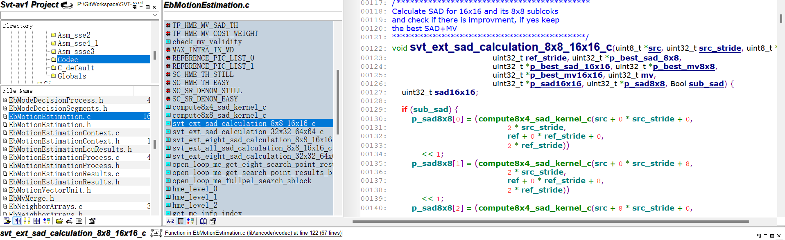
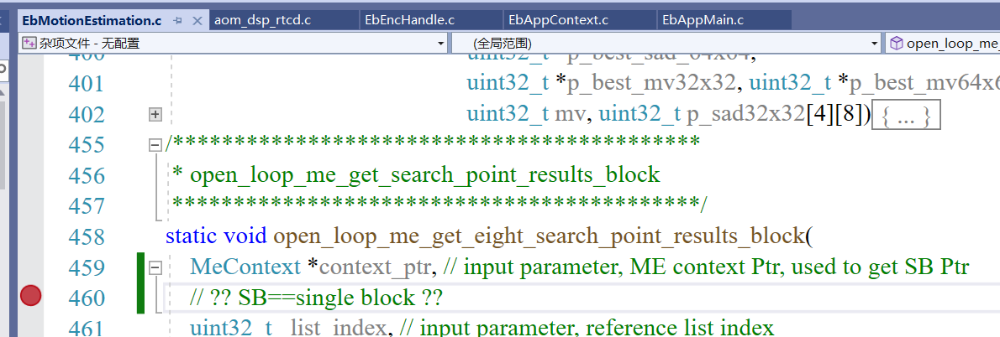
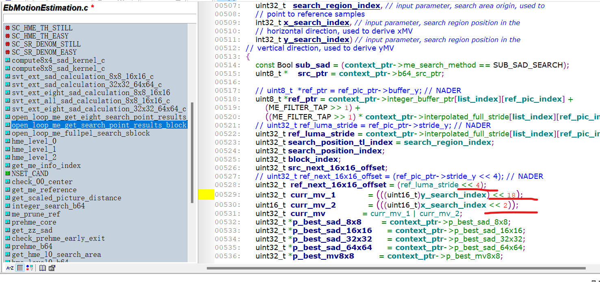
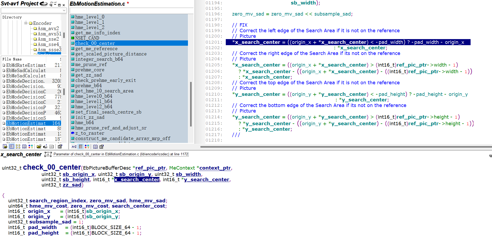

# 代码结构

---

## Lib-->Encoder-->Codec

---

### EbMotionEstimation.c

---

#### TF_HME_MV_SAD_TH 512
常量阈值，SAD_TH beyond which a penalty is applied to hme_mv_cost<br>


#### TF_HME_MV_COST_WEIGHT 125 
常量阈值，MV_COST weight when the SAD_TH condition is valid<br>

#### Bool check_my_validity(int16_t x_mv, int16_t y_mv, uint8_t need_shift)
检查motion vector的值的范围
```
AV1 limits
-16384 < MV_x_in_1/8 or MV_y_in_1/8 < 16384
which means in full pel:
-2048 < MV_x_in_full_pel or MV_y_in_full_pel < 2048
```

#### MAX_INTRA_IN_MD 9  ??
常量，<br>

#### REFERENCE_PIC_LIST_0 0 ??
常量，参考帧序号??<br>

#### REFERENCE_PIC_LIST_1 1

#### SC_HME_TH_STILL 1000 ??
常量，SC??_hardware ME_threshold_still<br>


#### SC_HME_TH_EASY 100 ??
常量，SC??_hardware ME_threshold_easy<br>

#### SC_SR_DENOM_STILL 16 ??
常量

#### SC_SR_DENOM_EASY 8 ??
常量

#### uint32_t compute8x4_sad_kernel_c(uint8_t *src, uint32_t src_stride, uint8_t *ref, uint32_t ref_stride)
```
    uint8_t *src, // input parameter, source samples Ptr
    uint32_t src_stride, // input parameter, source stride
    uint8_t *ref, // input parameter, reference samples Ptr
    uint32_t ref_stride // input parameter, reference stride
```
计算8x4块的SAD（sum of absolute differences）<br>

#### uint32_t compute8x8_sad_kernel_c(uint8_t *src, uint32_t src_stride, uint8_t *ref, uint32_t ref_stride)
类似[8x4](#uint32_t-compute8x4_sad_kernel_cuint8_t-src-uint32_t-src_stride-uint8_t-ref-uint32_t-ref_stride)<br>

#### void svt_ext_sad_calculation_8x8_16x16_c()
```
uint8_t *src, 
uint32_t src_stride, 
uint8_t *ref, 
uint32_t ref_stride, 
uint32_t *p_best_sad_8x8, 
uint32_t *p_best_sad_16x16, 
uint32_t*p_best_mv8x8,
uint32_t *p_best_mv16x16, 
uint32_t mv,
uint32_t *p_sad16x16, 
uint32_t *p_sad8x8,
Bool sub_sad) 
```
Calculate SAD for 16x16 and its 8x8 sublcoks 
and check if there is improvment, if yes keep the best SAD+MV<br>

#### void svt_ext_sad_calculation_32x32_64x64_c()
类似8x8_16x16  
[svt_ext_sad_calculation_8x8_16x16_c](#void-svt_ext_sad_calculation_8x8_16x16_c)
<br>

#### static void svt_ext_eight_sad_calculation_8x8_16x16()
更复杂的计算<br>

#### void svt_ext_all_sad_calculation_8x8_16x16_c()
类似<br>

#### void svt_ext_eight_sad_calculation_32x32_64x64_c()
类似[svt_ext_eight_sad_calculation_8x8_16x16](#static-void-svt_ext_eight_sad_calculation_8x8_16x16)<br>

#### static void open_loop_me_get_eight_search_point_results_block()
```
MeContext *context_ptr, // input parameter, ME context Ptr, used to get SB Ptr
// 什么是SB?? super block <确定>

uint32_t   list_index, // input parameter, reference list index
uint32_t   ref_pic_index,
uint32_t   search_region_index, // input parameter, search area origin, used to point to reference samples
int32_t x_search_index, // input parameter, search region position in the horizontal direction, used to derive xMV
int32_t y_search_index // input parameter, search region position in the vertical direction, used to derive yMV
``` 
<br>

#### static void open_loop_me_get_search_point_results_block()
```
MeContext *context_ptr, // input parameter, ME context Ptr, used to get SB Ptr

uint32_t   list_index, // input parameter, reference list index
uint32_t   ref_pic_index,
uint32_t   search_region_index, // input parameter, search area origin, used to point to reference samples
int32_t x_search_index, // input parameter, search region position in the horizontal direction, used to derive xMV
int32_t y_search_index // input parameter, search region position in the vertical direction, used to derive yMV
```
<br>
类似

[get_eight_search_point](#static-void-open_loop_me_get_eight_search_point_results_block)<br>
会调用SAD计算函数<br>


#### static void open_loop_me_fullpel_search_sblock()
```
MeContext *context_ptr, 
uint32_t list_index,
uint32_t ref_pic_index, 
int16_t x_search_area_origin,
int16_t  y_search_area_origin,
uint32_t search_area_width,
uint32_t search_area_height
```
会先调用[eight_search_point](#static-void-open_loop_me_get_eight_search_point_results_block)，再调用[search_point](#static-void-open_loop_me_get_search_point_results_block)<br>
前者will do: x_search_index, +1, +2, ..., +7<br>
大概是1/8 pel和full-pel<br>

#### static void hme_level_0()
```
MeContext *context_ptr, // ME context Ptr, used to get/update ME results
int16_t    origin_x, // Block position in the horizontal direction- sixteenth resolution
int16_t    origin_y, // Block position in the vertical direction- sixteenth resolution
uint32_t   block_width, // Block width - sixteenth resolution
uint32_t   block_height, // Block height - sixteenth resolution
int16_t    sa_width, // search area width
int16_t    sa_height, // search area height
EbPictureBufferDesc *sixteenth_ref_pic_ptr, // sixteenth-downsampled reference picture
uint32_t             sr_w, // current search region index in the horizontal direction
uint32_t             sr_h, // current search region index in the vertical direction
uint64_t *           best_sad, // output: Level0 SAD at (sr_w, sr_h)
int16_t *            hme_l0_sc_x, // output: Level0 xMV at (sr_w, sr_h)
int16_t *            hme_l0_sc_y // output: Level0 yMV at (sr_w, sr_h)
```
Perform HME Level 0 for one 64x64 block on the given picture<br>
会先修正搜索区域边缘，如果其不再当前参考帧<br>
调用[svt_sad_loop_kernel]将第一个搜索区域放入level0<br>
结果存到best_sad, hme_l0_sc_x, hme_l0_sc_y<br>

#### void hme_level_1()
类似[hme_level_0](#static-void-hme_level_0)<br>

#### void hme_level_2()
类似[hme_level_0](#static-void-hme_level_0)<br>

#### uint32_t get_me_info_index()
```
uint32_t max_me_block, 
const BlockGeom *blk_geom, 
uint32_t geom_offset_x,  
uint32_t geom_offset_y
```
获取ME的信息索引，me_info_index<br>

#### #define NSET_CAND ??
```
    NSET_CAND(me_pu_result, num, dist, dir)                      \
    (me_pu_result)->distortion_direction[(num)].distortion = (dist); \
    (me_pu_result)->distortion_direction[(num)].direction  = (dir);
```
不懂干嘛的<br>

#### uint32_t check_00_center()
```
EbPictureBufferDesc *ref_pic_ptr, 
MeContext *context_ptr,
uint32_t sb_origin_x, 
uint32_t sb_origin_y, 
uint32_t sb_width,
uint32_t sb_height, 
int16_t *x_search_center, 
int16_t *y_search_center,
uint32_t zz_sad
```


#### 

---

# Lib-->Encoder-->Codec
## EbMotionEstimation.c

对16x16的块结构计算SAD<br>
若对8x8的块，其SAD比当前最优值更小，则更新最优SAD，并将已有的mv赋给该块。16x16的SAD就是4个8x8块的相加<br>
类似地，可以对更大块32x32, 64x64执行类似计算。<br>

<center>

</center>


---

# App-->EncApp
## encoder入口
Source/App/EncApp/EbAppMain.c

定义pass数目，MAX_ENC_PASS=3

return_error=enc_context_ctor()

```
enc_context_ctor(&enc_app, &enc_context, argc, argv, enc_pass[pass_idx], passes) -->
return_error = read_command_line(argc, argv, enc_context->channels, num_channels);


```
enc_context_ctor()函数内部有编码器初始化的设置，channels数目，channel id等等


## 读取命令行
EbAppInputy4m.c
选项
```
-W width
-H height
-I scan type, not required, default: p. 还有t、b、?
-C color space, not required, default:420
-F frame rate, required
-A aspect ratio, not required

```


# Question
## 1. EbMotionEstimation
### 1.1 什么是SB
<center>

</center>

### 1.2 移位的值如何确定的
<center>

</center>

### 1.3 为什么重复赋值
<center>

</center>

## 2. 
